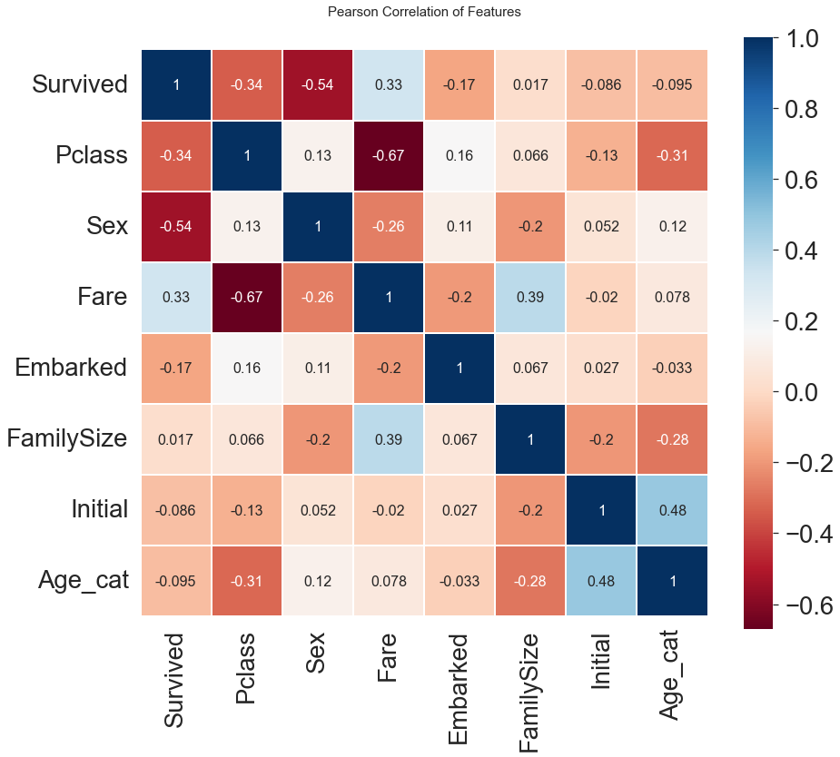
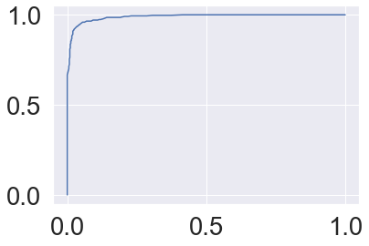

```python
import pandas as pd
import numpy as np
import matplotlib.pyplot as plt
import seaborn as sns

plt.style.use('seaborn')
sns.set(font_scale=2.5)

from sklearn.ensemble import RandomForestClassifier

from sklearn.metrics import roc_curve
from sklearn.metrics import roc_auc_score

#ignore warnings
import warnings
warnings.filterwarnings('ignore')

%matplotlib inline
```

# 1. Preprocessing


```python
df_train = pd.read_csv('titanic/train.csv')
df_test = pd.read_csv('titanic/test.csv')

df_train['FamilySize'] = df_train['SibSp'] + df_train['Parch'] + 1 # 1 for the passenger himself
df_test['FamilySize'] = df_test['SibSp'] + df_test['Parch'] + 1 # 1 for the passenger himself

df_test.loc[df_test.Fare.isnull(), 'Fare'] = df_test['Fare'].mean()

df_train['Fare'] = df_train['Fare'].map(lambda i: np.log(i) if i > 0 else 0)
df_test['Fare'] = df_test['Fare'].map(lambda i: np.log(i) if i > 0 else 0)

```

## 1.1 Fill Null


```python
df_train['Initial']= df_train.Name.str.extract('([A-Za-z]+)\.') #lets extract the Salutations
df_test['Initial']= df_test.Name.str.extract('([A-Za-z]+)\.') #lets extract the Salutations
```


```python
pd.crosstab(df_train['Initial'], df_train['Sex']).T.style.background_gradient(cmap='summer_r') #Checking the Initials with the Sex
```


<style type="text/css">
#T_5ae60_row0_col0, #T_5ae60_row0_col1, #T_5ae60_row0_col3, #T_5ae60_row0_col4, #T_5ae60_row0_col5, #T_5ae60_row0_col7, #T_5ae60_row0_col8, #T_5ae60_row0_col12, #T_5ae60_row0_col15, #T_5ae60_row0_col16, #T_5ae60_row1_col2, #T_5ae60_row1_col6, #T_5ae60_row1_col9, #T_5ae60_row1_col10, #T_5ae60_row1_col11, #T_5ae60_row1_col13, #T_5ae60_row1_col14 {
  background-color: #ffff66;
  color: #000000;
}
#T_5ae60_row0_col2, #T_5ae60_row0_col6, #T_5ae60_row0_col9, #T_5ae60_row0_col10, #T_5ae60_row0_col11, #T_5ae60_row0_col13, #T_5ae60_row0_col14, #T_5ae60_row1_col0, #T_5ae60_row1_col1, #T_5ae60_row1_col3, #T_5ae60_row1_col4, #T_5ae60_row1_col5, #T_5ae60_row1_col7, #T_5ae60_row1_col8, #T_5ae60_row1_col12, #T_5ae60_row1_col15, #T_5ae60_row1_col16 {
  background-color: #008066;
  color: #f1f1f1;
}
</style>
<table id="T_5ae60">
  <thead>
    <tr>
      <th class="index_name level0" >Initial</th>
      <th id="T_5ae60_level0_col0" class="col_heading level0 col0" >Capt</th>
      <th id="T_5ae60_level0_col1" class="col_heading level0 col1" >Col</th>
      <th id="T_5ae60_level0_col2" class="col_heading level0 col2" >Countess</th>
      <th id="T_5ae60_level0_col3" class="col_heading level0 col3" >Don</th>
      <th id="T_5ae60_level0_col4" class="col_heading level0 col4" >Dr</th>
      <th id="T_5ae60_level0_col5" class="col_heading level0 col5" >Jonkheer</th>
      <th id="T_5ae60_level0_col6" class="col_heading level0 col6" >Lady</th>
      <th id="T_5ae60_level0_col7" class="col_heading level0 col7" >Major</th>
      <th id="T_5ae60_level0_col8" class="col_heading level0 col8" >Master</th>
      <th id="T_5ae60_level0_col9" class="col_heading level0 col9" >Miss</th>
      <th id="T_5ae60_level0_col10" class="col_heading level0 col10" >Mlle</th>
      <th id="T_5ae60_level0_col11" class="col_heading level0 col11" >Mme</th>
      <th id="T_5ae60_level0_col12" class="col_heading level0 col12" >Mr</th>
      <th id="T_5ae60_level0_col13" class="col_heading level0 col13" >Mrs</th>
      <th id="T_5ae60_level0_col14" class="col_heading level0 col14" >Ms</th>
      <th id="T_5ae60_level0_col15" class="col_heading level0 col15" >Rev</th>
      <th id="T_5ae60_level0_col16" class="col_heading level0 col16" >Sir</th>
    </tr>
    <tr>
      <th class="index_name level0" >Sex</th>
      <th class="blank col0" >&nbsp;</th>
      <th class="blank col1" >&nbsp;</th>
      <th class="blank col2" >&nbsp;</th>
      <th class="blank col3" >&nbsp;</th>
      <th class="blank col4" >&nbsp;</th>
      <th class="blank col5" >&nbsp;</th>
      <th class="blank col6" >&nbsp;</th>
      <th class="blank col7" >&nbsp;</th>
      <th class="blank col8" >&nbsp;</th>
      <th class="blank col9" >&nbsp;</th>
      <th class="blank col10" >&nbsp;</th>
      <th class="blank col11" >&nbsp;</th>
      <th class="blank col12" >&nbsp;</th>
      <th class="blank col13" >&nbsp;</th>
      <th class="blank col14" >&nbsp;</th>
      <th class="blank col15" >&nbsp;</th>
      <th class="blank col16" >&nbsp;</th>
    </tr>
  </thead>
  <tbody>
    <tr>
      <th id="T_5ae60_level0_row0" class="row_heading level0 row0" >female</th>
      <td id="T_5ae60_row0_col0" class="data row0 col0" >0</td>
      <td id="T_5ae60_row0_col1" class="data row0 col1" >0</td>
      <td id="T_5ae60_row0_col2" class="data row0 col2" >1</td>
      <td id="T_5ae60_row0_col3" class="data row0 col3" >0</td>
      <td id="T_5ae60_row0_col4" class="data row0 col4" >1</td>
      <td id="T_5ae60_row0_col5" class="data row0 col5" >0</td>
      <td id="T_5ae60_row0_col6" class="data row0 col6" >1</td>
      <td id="T_5ae60_row0_col7" class="data row0 col7" >0</td>
      <td id="T_5ae60_row0_col8" class="data row0 col8" >0</td>
      <td id="T_5ae60_row0_col9" class="data row0 col9" >182</td>
      <td id="T_5ae60_row0_col10" class="data row0 col10" >2</td>
      <td id="T_5ae60_row0_col11" class="data row0 col11" >1</td>
      <td id="T_5ae60_row0_col12" class="data row0 col12" >0</td>
      <td id="T_5ae60_row0_col13" class="data row0 col13" >125</td>
      <td id="T_5ae60_row0_col14" class="data row0 col14" >1</td>
      <td id="T_5ae60_row0_col15" class="data row0 col15" >0</td>
      <td id="T_5ae60_row0_col16" class="data row0 col16" >0</td>
    </tr>
    <tr>
      <th id="T_5ae60_level0_row1" class="row_heading level0 row1" >male</th>
      <td id="T_5ae60_row1_col0" class="data row1 col0" >1</td>
      <td id="T_5ae60_row1_col1" class="data row1 col1" >2</td>
      <td id="T_5ae60_row1_col2" class="data row1 col2" >0</td>
      <td id="T_5ae60_row1_col3" class="data row1 col3" >1</td>
      <td id="T_5ae60_row1_col4" class="data row1 col4" >6</td>
      <td id="T_5ae60_row1_col5" class="data row1 col5" >1</td>
      <td id="T_5ae60_row1_col6" class="data row1 col6" >0</td>
      <td id="T_5ae60_row1_col7" class="data row1 col7" >2</td>
      <td id="T_5ae60_row1_col8" class="data row1 col8" >40</td>
      <td id="T_5ae60_row1_col9" class="data row1 col9" >0</td>
      <td id="T_5ae60_row1_col10" class="data row1 col10" >0</td>
      <td id="T_5ae60_row1_col11" class="data row1 col11" >0</td>
      <td id="T_5ae60_row1_col12" class="data row1 col12" >517</td>
      <td id="T_5ae60_row1_col13" class="data row1 col13" >0</td>
      <td id="T_5ae60_row1_col14" class="data row1 col14" >0</td>
      <td id="T_5ae60_row1_col15" class="data row1 col15" >6</td>
      <td id="T_5ae60_row1_col16" class="data row1 col16" >1</td>
    </tr>
  </tbody>
</table>


```python
df_train['Initial'].replace(['Mlle','Mme','Ms','Dr','Major','Lady','Countess','Jonkheer','Col','Rev','Capt','Sir','Don', 'Dona'],
                        ['Miss','Miss','Miss','Mr','Mr','Mrs','Mrs','Other','Other','Other','Mr','Mr','Mr', 'Mr'],inplace=True)

df_test['Initial'].replace(['Mlle','Mme','Ms','Dr','Major','Lady','Countess','Jonkheer','Col','Rev','Capt','Sir','Don', 'Dona'],
                        ['Miss','Miss','Miss','Mr','Mr','Mrs','Mrs','Other','Other','Other','Mr','Mr','Mr', 'Mr'],inplace=True)
```


```python
df_train.groupby('Initial').mean()
```


<div>
<style scoped>
    .dataframe tbody tr th:only-of-type {
        vertical-align: middle;
    }

    .dataframe tbody tr th {
        vertical-align: top;
    }

    .dataframe thead th {
        text-align: right;
    }
</style>
<table border="1" class="dataframe">
  <thead>
    <tr style="text-align: right;">
      <th></th>
      <th>PassengerId</th>
      <th>Survived</th>
      <th>Pclass</th>
      <th>Age</th>
      <th>SibSp</th>
      <th>Parch</th>
      <th>Fare</th>
      <th>FamilySize</th>
    </tr>
    <tr>
      <th>Initial</th>
      <th></th>
      <th></th>
      <th></th>
      <th></th>
      <th></th>
      <th></th>
      <th></th>
      <th></th>
    </tr>
  </thead>
  <tbody>
    <tr>
      <th>Master</th>
      <td>414.975000</td>
      <td>0.575000</td>
      <td>2.625000</td>
      <td>4.574167</td>
      <td>2.300000</td>
      <td>1.375000</td>
      <td>3.340710</td>
      <td>4.675000</td>
    </tr>
    <tr>
      <th>Miss</th>
      <td>411.741935</td>
      <td>0.704301</td>
      <td>2.284946</td>
      <td>21.860000</td>
      <td>0.698925</td>
      <td>0.537634</td>
      <td>3.123713</td>
      <td>2.236559</td>
    </tr>
    <tr>
      <th>Mr</th>
      <td>455.880907</td>
      <td>0.162571</td>
      <td>2.381853</td>
      <td>32.739609</td>
      <td>0.293006</td>
      <td>0.151229</td>
      <td>2.651507</td>
      <td>1.444234</td>
    </tr>
    <tr>
      <th>Mrs</th>
      <td>456.393701</td>
      <td>0.795276</td>
      <td>1.984252</td>
      <td>35.981818</td>
      <td>0.692913</td>
      <td>0.818898</td>
      <td>3.443751</td>
      <td>2.511811</td>
    </tr>
    <tr>
      <th>Other</th>
      <td>564.444444</td>
      <td>0.111111</td>
      <td>1.666667</td>
      <td>45.888889</td>
      <td>0.111111</td>
      <td>0.111111</td>
      <td>2.641605</td>
      <td>1.222222</td>
    </tr>
  </tbody>
</table>
</div>


```python
df_train.groupby('Initial')['Survived'].mean().plot.bar()
```


    <AxesSubplot:xlabel='Initial'>


    

    


```python
df_train.groupby('Initial').mean()
```


<div>
<style scoped>
    .dataframe tbody tr th:only-of-type {
        vertical-align: middle;
    }

    .dataframe tbody tr th {
        vertical-align: top;
    }

    .dataframe thead th {
        text-align: right;
    }
</style>
<table border="1" class="dataframe">
  <thead>
    <tr style="text-align: right;">
      <th></th>
      <th>PassengerId</th>
      <th>Survived</th>
      <th>Pclass</th>
      <th>Age</th>
      <th>SibSp</th>
      <th>Parch</th>
      <th>Fare</th>
      <th>FamilySize</th>
    </tr>
    <tr>
      <th>Initial</th>
      <th></th>
      <th></th>
      <th></th>
      <th></th>
      <th></th>
      <th></th>
      <th></th>
      <th></th>
    </tr>
  </thead>
  <tbody>
    <tr>
      <th>Master</th>
      <td>414.975000</td>
      <td>0.575000</td>
      <td>2.625000</td>
      <td>4.574167</td>
      <td>2.300000</td>
      <td>1.375000</td>
      <td>3.340710</td>
      <td>4.675000</td>
    </tr>
    <tr>
      <th>Miss</th>
      <td>411.741935</td>
      <td>0.704301</td>
      <td>2.284946</td>
      <td>21.860000</td>
      <td>0.698925</td>
      <td>0.537634</td>
      <td>3.123713</td>
      <td>2.236559</td>
    </tr>
    <tr>
      <th>Mr</th>
      <td>455.880907</td>
      <td>0.162571</td>
      <td>2.381853</td>
      <td>32.739609</td>
      <td>0.293006</td>
      <td>0.151229</td>
      <td>2.651507</td>
      <td>1.444234</td>
    </tr>
    <tr>
      <th>Mrs</th>
      <td>456.393701</td>
      <td>0.795276</td>
      <td>1.984252</td>
      <td>35.981818</td>
      <td>0.692913</td>
      <td>0.818898</td>
      <td>3.443751</td>
      <td>2.511811</td>
    </tr>
    <tr>
      <th>Other</th>
      <td>564.444444</td>
      <td>0.111111</td>
      <td>1.666667</td>
      <td>45.888889</td>
      <td>0.111111</td>
      <td>0.111111</td>
      <td>2.641605</td>
      <td>1.222222</td>
    </tr>
  </tbody>
</table>
</div>


```python
df_train.loc[(df_train.Age.isnull())&(df_train.Initial=='Mr'),'Age'] = 33
df_train.loc[(df_train.Age.isnull())&(df_train.Initial=='Mrs'),'Age'] = 36
df_train.loc[(df_train.Age.isnull())&(df_train.Initial=='Master'),'Age'] = 5
df_train.loc[(df_train.Age.isnull())&(df_train.Initial=='Miss'),'Age'] = 22
df_train.loc[(df_train.Age.isnull())&(df_train.Initial=='Other'),'Age'] = 46

df_test.loc[(df_test.Age.isnull())&(df_test.Initial=='Mr'),'Age'] = 33
df_test.loc[(df_test.Age.isnull())&(df_test.Initial=='Mrs'),'Age'] = 36
df_test.loc[(df_test.Age.isnull())&(df_test.Initial=='Master'),'Age'] = 5
df_test.loc[(df_test.Age.isnull())&(df_test.Initial=='Miss'),'Age'] = 22
df_test.loc[(df_test.Age.isnull())&(df_test.Initial=='Other'),'Age'] = 46
```


```python
print(f'Embarked has f{sum(df_train["Embarked"].isnull())} Null values')
```

    Embarked has f2 Null values
    


```python
df_train['Embarked'].fillna('S', inplace=True)
```

## 1.2 Change Age(Continuous to categorical)


```python
def category_age(x):
    if x < 10:
        return 0
    elif x < 20:
        return 1
    elif x < 30:
        return 2
    elif x < 40:
        return 3
    elif x < 50:
        return 4
    elif x < 60:
        return 5
    elif x < 70:
        return 6
    else:
        return 7    
    
df_train['Age_cat'] = df_train['Age'].apply(category_age)
df_test['Age_cat'] = df_test['Age'].apply(category_age)
```


```python
df_train.drop(['Age'], axis=1, inplace=True)
df_test.drop(['Age'], axis=1, inplace=True)
```

## 1.3 Change Initial, Embarked and Sex(String to Numerical)


```python
df_train['Initial'] = df_train['Initial'].map({'Master': 0, 'Miss': 1, 'Mr': 2, 'Mrs': 3, 'Other': 4})
df_test['Initial'] = df_test['Initial'].map({'Master': 0, 'Miss': 1, 'Mr': 2, 'Mrs': 3, 'Other': 4})
```


```python
df_train['Embarked'].unique()
```


    array(['S', 'C', 'Q'], dtype=object)


```python
df_train['Embarked'].value_counts()
```


    S    646
    C    168
    Q     77
    Name: Embarked, dtype: int64


```python
df_train['Embarked'] = df_train['Embarked'].map({'C': 0, 'Q': 1, 'S': 2})
df_test['Embarked'] = df_test['Embarked'].map({'C': 0, 'Q': 1, 'S': 2})
```


```python
df_train['Embarked'].isnull().any()
```


    False


```python
df_train['Sex'] = df_train['Sex'].map({'female': 0, 'male': 1})
df_test['Sex'] = df_test['Sex'].map({'female': 0, 'male': 1})
```


```python
heatmap_data = df_train[['Survived', 'Pclass', 'Sex', 'Fare', 'Embarked', 'FamilySize', 'Initial', 'Age_cat']] 

colormap = plt.cm.RdBu
plt.figure(figsize=(14, 12))
plt.title('Pearson Correlation of Features', y=1.05, size=15)
sns.heatmap(heatmap_data.astype(float).corr(), linewidths=0.1, vmax=1.0,
           square=True, cmap=colormap, linecolor='white', annot=True, annot_kws={"size": 16})

del heatmap_data
```


    

    


## 1.4 One-hot encoding on Initial and Embarked


```python
df_train = pd.get_dummies(df_train, columns=['Initial'], prefix='Initial')
df_test = pd.get_dummies(df_test, columns=['Initial'], prefix='Initial')
```


```python
df_train.head()
```


<div>
<style scoped>
    .dataframe tbody tr th:only-of-type {
        vertical-align: middle;
    }

    .dataframe tbody tr th {
        vertical-align: top;
    }

    .dataframe thead th {
        text-align: right;
    }
</style>
<table border="1" class="dataframe">
  <thead>
    <tr style="text-align: right;">
      <th></th>
      <th>PassengerId</th>
      <th>Survived</th>
      <th>Pclass</th>
      <th>Name</th>
      <th>Sex</th>
      <th>SibSp</th>
      <th>Parch</th>
      <th>Ticket</th>
      <th>Fare</th>
      <th>Cabin</th>
      <th>Embarked</th>
      <th>FamilySize</th>
      <th>Age_cat</th>
      <th>Initial_0</th>
      <th>Initial_1</th>
      <th>Initial_2</th>
      <th>Initial_3</th>
      <th>Initial_4</th>
    </tr>
  </thead>
  <tbody>
    <tr>
      <th>0</th>
      <td>1</td>
      <td>0</td>
      <td>3</td>
      <td>Braund, Mr. Owen Harris</td>
      <td>1</td>
      <td>1</td>
      <td>0</td>
      <td>A/5 21171</td>
      <td>1.981001</td>
      <td>NaN</td>
      <td>2</td>
      <td>2</td>
      <td>2</td>
      <td>0</td>
      <td>0</td>
      <td>1</td>
      <td>0</td>
      <td>0</td>
    </tr>
    <tr>
      <th>1</th>
      <td>2</td>
      <td>1</td>
      <td>1</td>
      <td>Cumings, Mrs. John Bradley (Florence Briggs Th...</td>
      <td>0</td>
      <td>1</td>
      <td>0</td>
      <td>PC 17599</td>
      <td>4.266662</td>
      <td>C85</td>
      <td>0</td>
      <td>2</td>
      <td>3</td>
      <td>0</td>
      <td>0</td>
      <td>0</td>
      <td>1</td>
      <td>0</td>
    </tr>
    <tr>
      <th>2</th>
      <td>3</td>
      <td>1</td>
      <td>3</td>
      <td>Heikkinen, Miss. Laina</td>
      <td>0</td>
      <td>0</td>
      <td>0</td>
      <td>STON/O2. 3101282</td>
      <td>2.070022</td>
      <td>NaN</td>
      <td>2</td>
      <td>1</td>
      <td>2</td>
      <td>0</td>
      <td>1</td>
      <td>0</td>
      <td>0</td>
      <td>0</td>
    </tr>
    <tr>
      <th>3</th>
      <td>4</td>
      <td>1</td>
      <td>1</td>
      <td>Futrelle, Mrs. Jacques Heath (Lily May Peel)</td>
      <td>0</td>
      <td>1</td>
      <td>0</td>
      <td>113803</td>
      <td>3.972177</td>
      <td>C123</td>
      <td>2</td>
      <td>2</td>
      <td>3</td>
      <td>0</td>
      <td>0</td>
      <td>0</td>
      <td>1</td>
      <td>0</td>
    </tr>
    <tr>
      <th>4</th>
      <td>5</td>
      <td>0</td>
      <td>3</td>
      <td>Allen, Mr. William Henry</td>
      <td>1</td>
      <td>0</td>
      <td>0</td>
      <td>373450</td>
      <td>2.085672</td>
      <td>NaN</td>
      <td>2</td>
      <td>1</td>
      <td>3</td>
      <td>0</td>
      <td>0</td>
      <td>1</td>
      <td>0</td>
      <td>0</td>
    </tr>
  </tbody>
</table>
</div>


```python
df_train = pd.get_dummies(df_train, columns=['Embarked'], prefix='Embarked')
df_test = pd.get_dummies(df_test, columns=['Embarked'], prefix='Embarked')
```

## 1.5 Drop columns


```python
df_train.drop(['Name', 'SibSp', 'Parch', 'Ticket', 'Cabin'], axis=1, inplace=True)
df_test.drop(['Name',  'SibSp', 'Parch', 'Ticket', 'Cabin'], axis=1, inplace=True)
```


```python
df_train.head()
```


<div>
<style scoped>
    .dataframe tbody tr th:only-of-type {
        vertical-align: middle;
    }

    .dataframe tbody tr th {
        vertical-align: top;
    }

    .dataframe thead th {
        text-align: right;
    }
</style>
<table border="1" class="dataframe">
  <thead>
    <tr style="text-align: right;">
      <th></th>
      <th>PassengerId</th>
      <th>Survived</th>
      <th>Pclass</th>
      <th>Sex</th>
      <th>Fare</th>
      <th>FamilySize</th>
      <th>Age_cat</th>
      <th>Initial_0</th>
      <th>Initial_1</th>
      <th>Initial_2</th>
      <th>Initial_3</th>
      <th>Initial_4</th>
      <th>Embarked_0</th>
      <th>Embarked_1</th>
      <th>Embarked_2</th>
    </tr>
  </thead>
  <tbody>
    <tr>
      <th>0</th>
      <td>1</td>
      <td>0</td>
      <td>3</td>
      <td>1</td>
      <td>1.981001</td>
      <td>2</td>
      <td>2</td>
      <td>0</td>
      <td>0</td>
      <td>1</td>
      <td>0</td>
      <td>0</td>
      <td>0</td>
      <td>0</td>
      <td>1</td>
    </tr>
    <tr>
      <th>1</th>
      <td>2</td>
      <td>1</td>
      <td>1</td>
      <td>0</td>
      <td>4.266662</td>
      <td>2</td>
      <td>3</td>
      <td>0</td>
      <td>0</td>
      <td>0</td>
      <td>1</td>
      <td>0</td>
      <td>1</td>
      <td>0</td>
      <td>0</td>
    </tr>
    <tr>
      <th>2</th>
      <td>3</td>
      <td>1</td>
      <td>3</td>
      <td>0</td>
      <td>2.070022</td>
      <td>1</td>
      <td>2</td>
      <td>0</td>
      <td>1</td>
      <td>0</td>
      <td>0</td>
      <td>0</td>
      <td>0</td>
      <td>0</td>
      <td>1</td>
    </tr>
    <tr>
      <th>3</th>
      <td>4</td>
      <td>1</td>
      <td>1</td>
      <td>0</td>
      <td>3.972177</td>
      <td>2</td>
      <td>3</td>
      <td>0</td>
      <td>0</td>
      <td>0</td>
      <td>1</td>
      <td>0</td>
      <td>0</td>
      <td>0</td>
      <td>1</td>
    </tr>
    <tr>
      <th>4</th>
      <td>5</td>
      <td>0</td>
      <td>3</td>
      <td>1</td>
      <td>2.085672</td>
      <td>1</td>
      <td>3</td>
      <td>0</td>
      <td>0</td>
      <td>1</td>
      <td>0</td>
      <td>0</td>
      <td>0</td>
      <td>0</td>
      <td>1</td>
    </tr>
  </tbody>
</table>
</div>


```python
df_test.head()
```


<div>
<style scoped>
    .dataframe tbody tr th:only-of-type {
        vertical-align: middle;
    }

    .dataframe tbody tr th {
        vertical-align: top;
    }

    .dataframe thead th {
        text-align: right;
    }
</style>
<table border="1" class="dataframe">
  <thead>
    <tr style="text-align: right;">
      <th></th>
      <th>PassengerId</th>
      <th>Pclass</th>
      <th>Sex</th>
      <th>Fare</th>
      <th>FamilySize</th>
      <th>Age_cat</th>
      <th>Initial_0</th>
      <th>Initial_1</th>
      <th>Initial_2</th>
      <th>Initial_3</th>
      <th>Initial_4</th>
      <th>Embarked_0</th>
      <th>Embarked_1</th>
      <th>Embarked_2</th>
    </tr>
  </thead>
  <tbody>
    <tr>
      <th>0</th>
      <td>892</td>
      <td>3</td>
      <td>1</td>
      <td>2.057860</td>
      <td>1</td>
      <td>3</td>
      <td>0</td>
      <td>0</td>
      <td>1</td>
      <td>0</td>
      <td>0</td>
      <td>0</td>
      <td>1</td>
      <td>0</td>
    </tr>
    <tr>
      <th>1</th>
      <td>893</td>
      <td>3</td>
      <td>0</td>
      <td>1.945910</td>
      <td>2</td>
      <td>4</td>
      <td>0</td>
      <td>0</td>
      <td>0</td>
      <td>1</td>
      <td>0</td>
      <td>0</td>
      <td>0</td>
      <td>1</td>
    </tr>
    <tr>
      <th>2</th>
      <td>894</td>
      <td>2</td>
      <td>1</td>
      <td>2.270836</td>
      <td>1</td>
      <td>6</td>
      <td>0</td>
      <td>0</td>
      <td>1</td>
      <td>0</td>
      <td>0</td>
      <td>0</td>
      <td>1</td>
      <td>0</td>
    </tr>
    <tr>
      <th>3</th>
      <td>895</td>
      <td>3</td>
      <td>1</td>
      <td>2.159003</td>
      <td>1</td>
      <td>2</td>
      <td>0</td>
      <td>0</td>
      <td>1</td>
      <td>0</td>
      <td>0</td>
      <td>0</td>
      <td>0</td>
      <td>1</td>
    </tr>
    <tr>
      <th>4</th>
      <td>896</td>
      <td>3</td>
      <td>0</td>
      <td>2.508582</td>
      <td>3</td>
      <td>2</td>
      <td>0</td>
      <td>0</td>
      <td>0</td>
      <td>1</td>
      <td>0</td>
      <td>0</td>
      <td>0</td>
      <td>1</td>
    </tr>
  </tbody>
</table>
</div>


# 2. Machine Learning


```python
from sklearn.ensemble import RandomForestClassifier 
from sklearn import metrics 
from sklearn.model_selection import train_test_split
```

## 2.1 Create data for training


```python
X_train = df_train.drop(['PassengerId','Survived'], axis=1)
Y_train = df_train['Survived']
X_test = df_test.drop(['PassengerId'], axis=1)
```

## 2.2 Classifier and accuracy, AUC, and ROC curve


```python
classifier = RandomForestClassifier()
classifier.fit(X_train, Y_train)
accuracy = classifier.score(X_train, Y_train) * 100
Y_train_pred = classifier.predict_proba(X_train)[:, 1]

FPR, TPR, thresholds = roc_curve(Y_train, Y_train_pred)
AUC = roc_auc_score(Y_train, Y_train_pred)

plt.plot(FPR, TPR)
print("Accuracy: ", "{0:.2f}".format(accuracy))
print("Area Under the Curve: ", "{0:.2f}".format(AUC))
```

    Accuracy:  95.40
    Area Under the Curve:  0.99
    


    

    


## 2.3 Generate Kaggle submission


```python
predict = classifier.predict(X_test)
predict = np.round(predict)

submission = pd.DataFrame({'PassengerId': df_test['PassengerId'], 'Survived': predict})
submission.to_csv('titanic/submission.csv', index=False)
```

